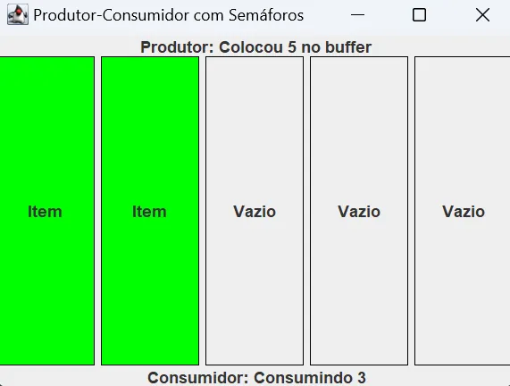

# Problema Produtor Consumidor

**Autores**: 
[Hugo Gustavo Cordeiro](https://github.com/ugoincc), 
[Kelyton Medeiros Lacerda](https://github.com/Kelyton21). 
**Novembro de 2024**  
Primeiro trabalho da disciplina "Sistemas Operacionais".  
Este projeto visa implementar duas soluções para o clássico problema produtor-consumidor (Producer-Consumer problem) de sincronização em sistemas concorrentes. 

Linguagem: Java 22.0.2 - IDE: Intellij IDEA

#### Especificação do trabalho: 
Implemente o problema produtor-consumidor usando linguagem Java e utilizando o recurso de sincronização de sua escolha. Explique sua solução e justifique suas escolhas.  
Utilize recursos para passagem de mensagem que permita implementar o problema produtor-consumidor. Explique a sua solução. 
Para ambos os problemas apresente alguma interface gráfica que permita ilustrar o problema, também deve conter de forma fácil a definição de parâmetros do problema, tais como velocidade do produtor e consumidor, tamanho do buffer, entre outros.

## Descrição do Problema

O problema envolve dois tipos de processos:

- Produtor: Gera dados e os coloca em buffer.
- Consumidor: Retira dados do buffer para processá-los.

O Buffer tem capacidade limitada, então o produtor não deve inserir dados quando o buffer estiver cheio, já o consumidor não deve remover dados se o buffer estiver vazio. 

Ambos não podem inserir e remover dados simultâneamente.

### Objetivo do trabalho

Garantir que o produtor e consumidor possam operar sem conflitos ou interferências, utilizando o buffer de maneira segura. Esse problema destaca a importância de controle de concorrência para evitar:

- **Condição de corrida**: onde os processos interferem no acesso ao buffer de maneira imprevisível.
- **Deadlock**: quando ambos processos ficam bloqueados, incapazes de prosseguir.
- **Starvation**: onde um dos processos é constantemente impedido de acessar o buffer.

### Solução escolhida

Para resolver o problema, utilizamos o mecanismo de sincronização chamado Semáforo. A linguagem utilizada para implementar a solução foi Java, na qual podemos utilizar a classe `Semaphore` da biblioteca padrão.

Arquivo de referência: [Programa com Semáforos](./src/ProducerConsumerSemaphoreGUI.java).

Alternativamente utilizamos o `ArrayBlockingQueue`  que bloqueará o produtor quando estiver cheia e o consumidor quando estiver vazia. Esta solução permite a implementação com passagem de mensagem.

Arquivo de referência: [Programa com Fila](./src/ProducerConsumerGUI.java).

### Justificativa

O uso de Semáforos permite um controle fino sobre a quantidade de threads que acessam um recurso compartilhado. É útil para garantir que não haja ‘overflow’ ou ‘underflow’ no buffer de produção-consumo. Outro motivo é a facilidade de utilizar a classe padrão em Java, que abstrai muitas complexidades associadas ao manejo de threads, onde soluções como `wait()` e `notify()` ou bloqueios são mais propensas a erros para sincronização de threads.

Já no `BlockingQueue`  não há necessidade de manipular diretamente semáforos ou bloquear/desbloquar manualmente, além de possibilitar a escalabilidade, permitindo a sincronização entre várias threads e eliminando a condição de corrida utilizando filas.

### Classes e Interfaces

A estrutura do buffer é definida pela interface `Queue` que requer uma classe que extenda-a para criar um objeto. O tipo escolhido foi `LinkedList` e seu tamanho pode ser alterado na variável `BUFFER_SIZE` .

Para gerenciar o acesso ao buffer compatilhado foram utilizados dois semáforos e um `ReentrantLock` :

- `spacesSemaphore`- conta os espaços vazios no buffer, inicialmente seu tamanho é o numero de slots no buffer
- `itemsSemaphore`- conta os itens no buffer e garante que o consumidor espere caso o buffer esteja vazio - valor inicial é 0.
- `lock` - interface que garante acesso exclusivo para threads evitando condições de corrida.

### Métodos utilizados

**Solução Semáforo**

- `semaphore.acquire()` - Espera por um item/espaço disponível
- `semaphore.release()` - Sinaliza que há um item/espaço disponível
- `lock.lock()` - Trava o Buffer para evitar concorrência
- `lock.unlock()` - Libera o Buffer

**Solução Alternativa**

- `queue.put(item)`  - Adiciona o item à fila, e bloqueia o produtor caso esteja cheia
- `queue.take(item)`  - Retira um item da fila, e bloqueia o consumidor caso esteja vazia

Em ambos programas, para ajustar a simulação de velocidade de produção e consumo, basta modificar o argumento de `Thread.sleep()` na respectiva classe (Producer / Consumer) para o período desejado em milissegundos (ms).

### Interface Gráfica

O programa possui uma interface para ilustrar a atuação das threads no buffer, cada slot é representado por uma caixa, onde seu status pode ser definido por: Item ou Vazio.

**Acima do buffer**: Ultima ação do Produtor

**Abaixo do buffer**: Ultima ação do Consumidor

